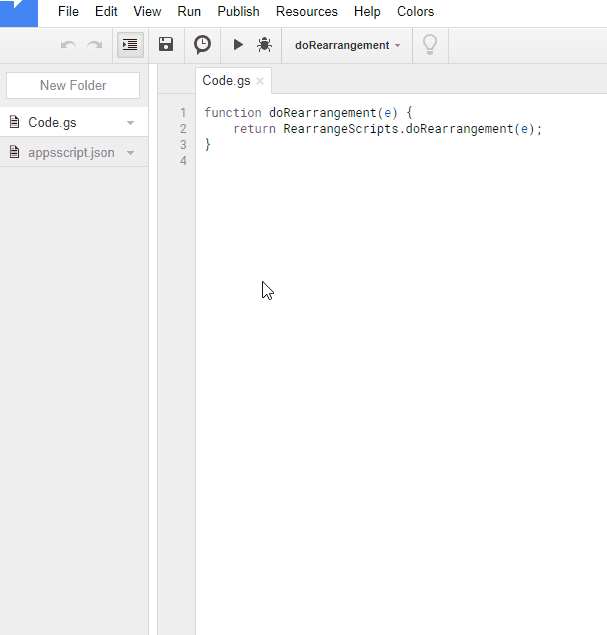

RearrangeScripts
=====

# Overview
This is an **add-on** GAS application for rearranging Google Apps Scripts (GAS) in a project which can be seen at the script editor.

# Demo

# Description
Have you ever thought about rearranging Google Apps Scripts in a project which can be seen at the script editor? I also have thought about it. Finally, I could find the workaround to do it. And recently, I have given this function to [ggsrun](https://github.com/tanaikech/ggsrun/blob/master/help/README.md#rearrangescripts) which is a CLI tool. Furthermore, I thought that if there is a GUI application for rearranging scripts in a project, it may be useful for more users. So I created this. Today, I published this as a GUI tool using Google Apps Script. If this was useful for you, I'm glad.

**[At December 20th, 2017, this was published as an add-on application.](https://chrome.google.com/webstore/detail/rearrangescripts/ndaicidjkbcpajgejcclgfdcncpoekml?utm_source=permalink)**

# How to install
1. Create new spreadsheet.
1. Click "Add-ons" at menu bar.
1. Select "Get add-ons".
1. Input "rearrangescripts" in "Search add-ons".
1. Install rearrangescripts.

# Usage
Please see the above demonstration movie.

### IMPORTANT!
> 1. For rearranging scripts, there is one important point. <u>**When scripts in a project is rearranged, version history of scripts is reset once. So if you don't want to reset the version history, please push "Save!" with "Create as new project".**</u> By saving with "Create as new project", new project with the rearranged scripts will be created to root folder on your Google Drive. When you click "Overwrite to project", the rearranged scripts will be reflected to the selected project.
> 2. The rearrangement of scripts can be done for only standalone scripts. Because although the bound scripts can retrieve scripts, it cannot be updated.

# Principle of rearranging
1. Download all scripts in a project.
1. Overwrite the project by one script with the filename which is difference from the filenames of downloaded scripts.
1. Rearrange the downloaded scripts.
1. Overwrite the project by the rearranged scripts. At this time, remove the script ID of each script.

When existing project is overwritten by a script with an unique filename, all scripts in the project are removed and only the file with the unique name is remained. I thought that this can be applied for rearranging scripts.

For operating project, you can use [ProjectApp](https://github.com/tanaikech/ProjectApp). This application also uses ProjectApp.

-----

# Licence
[MIT](LICENCE)

# Author
[Tanaike](https://tanaikech.github.io/about/)

If you have any questions and commissions for me, feel free to tell me.

# Update History
* v1.0.0 (November 13, 2017)

    Initial release.

* v1.0.1 (November 23, 2017)

    - Modified README.md
        - It reported that scopes used at this library can automatically install.
        - The detail information about this can be seen at [here](https://gist.github.com/tanaikech/23ddf599a4155b66f1029978bba8153b).

* v2.0.0 (December 20, 2017)

    [RearrangeScripts was published as an add-on application.](https://chrome.google.com/webstore/detail/rearrangescripts/ndaicidjkbcpajgejcclgfdcncpoekml?utm_source=permalink)

[TOP](#TOP)
